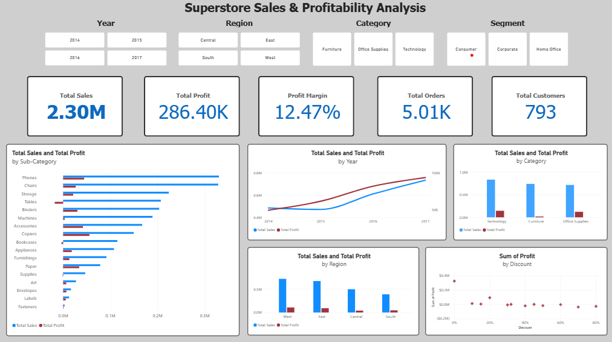

# Superstore Sales & Profitability Analysis
This project analyzes a Superstore's transactions to evaluate sales performance and profitability across products, customers, regions, and discount levels. The analysis focuses on identifying patterns that help explain where the business is performing well and where profitability is a concern.

## Dataset
- Source: Kaggle - Superstore Dataset
- Records: 9,994
- Original Variables: 21
- Key variables: Order Date, Ship Date, Sales, Quantity, Discount, Profit, Category, Sub-Category, Segment, Region, Customer ID, and Product ID
- Derived variable: `Year`, created from Order Date for analysis

## Business Questions
- 1. **Overall Performance:** What is the size and financial performance of the Superstore? How have sales and profitability changed over time?
- 2. **Product Performance:** Which products and product categories are driving sales and profitability? Where are there significant differences between sales and profit?
- 3. **Customer Analysis:** Which customer segments generate the most value? Are customers with high sales also the most profitable?
- 4. **Regional Analysis:** How does profitability vary across regions and states? Where do high sales fail to translate into profit?
- 5. **Discounts & Profitability:**  How does discounting affect sales and profitability? At what discount levels does profitability decline?

## Tools and Technologies Used
- `Python`: Pandas, Matplotlib
- `SQL`: DuckDB
- Data Visualization: `Power BI`
- Development Environment: `Jupyter Notebook`, `VS Code`, `Spyder`

## Analysis
The analysis had several stages:
- 1. **Data exploration:** The dataset was inspected for missing values, duplicates, data types, and consistency.
- 2. **Overall Performance:** Calculated `total sales`, `total profit`, `profit margin`, `unique orders`, `unique customers`, `unique products`, `average order value`, and `average profit per order`. 
- 3. **Product Analysis:** Compared sales and profitability across categories, sub-categories, and individual products. 
- 4. **Customer Analysis:** Evaluated sales and profitability across customer segments and individual customers.
- 5. **Regional Analysis:** Compared sales, profit, and profit margins across regions and states.
- 6. **Discount Analysis:** Examined the relationship between discount levels and profitability.
- 7. **Visualization:** Developed an interactive Power BI dashboard to visualize key trends and explore performance using filters.

## Key Findings
- **Overall Performance:** The Superstore had `5,009` orders from `793` customers and generated approximately `$2.30 million` in sales and `$286,397` in profit, resulting in an profit margin of `12.47%`.
- **Product Analysis:** Technology generated the highest sales (`$836K`) and profit (`$145K`) among the three categories, while Furniture generated `$742K` in sales but only `$18.45K` in profit, resulting in a lower profit margin of `2.49%`. Several sub-categories, including `Tables`, `Bookcases`, and `Supplies` generated negative profit.
- **Customer Analysis:** The Consumer segment generated the highest sales at `$1.16 million`, while the Home Office segment had the highest profit margin at `14.03%`. Individual customer performance also varied, with some high-sales customers generating negative profit.
- **Regional Analysis:** The `West` region generated the highest sales (`$725K`) and profit (`$108K`). However, higher sales do not necessarily translate into higher profitability, with several high-sales states having negative profit margins and the `Central` region having the lowest profit margin despite generating more sales than the South region.
- **Discount Analysis:** Higher discount levels were associated with substantially lower profitability. Transactions with discounts of 30% or more generated approximately `$363K` in sales but a loss of `$135K`, corresponding to a negative profit margin of approximately `-37.32%`.

## Recommendations
- Investigate categories and sub-categories with low or negative profitability, particularly `Furniture` and sub-categories such as `Tables, Bookcases, and Supplies`. Examine pricing, discount levels, and other factors that may contribute to their low margins.
- Prioritize customer profitability when evaluating high-value customers and segments. Customers with both high sales and high profit can be examined to identify characteristics associated with more profitable customers.
- Investigate regions and states where strong sales are not translating into profitability. Areas such as the `Central` region and states such as `Texas` should be examined to identify factors contributing to their lower profitability. The Superstore could then consider region-specific strategies based on the factors identified, rather than focusing only on increasing sales.
- Evaluate whether high discount levels are concentrated among particular products, regions, or customer groups to determine whether adjustments to the discount strategy may be appropriate.

## Power BI dashboard

## Project files
- `data/superstore_dataset.csv`
   Original Superstore dataset from Kaggle.

- `data/superstore_cleaned_dataset.csv`
   Cleaned and prepared dataset used throughout the analysis.

- `01_data_exploration.ipynb`
   Contains data inspection, data preparation, and an initial overall performance analysis.

- `02_sql_analysis.sql`
   SQL analysis of the dataset using DuckDB. 

- `03_python_analysis.ipynb`
   Contains the main analysis, including overall performance, product analysis, customer analysis, regional analysis, and discount and profitability analysis, along with visualizations, key findings, business implications, and recommendations.

- `superstore_sales_profitability_dashboard.pbix`
   Interactive Power BI dashboard summarizing key metrics, trends, and profitability insights across the Superstore.